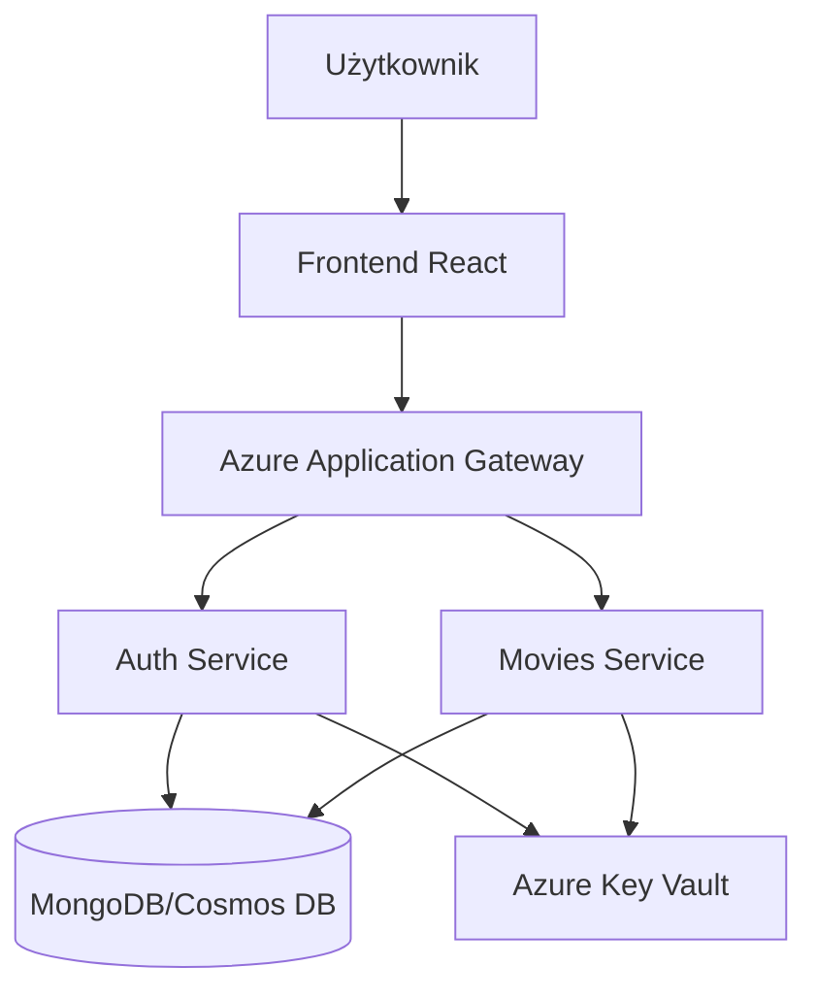
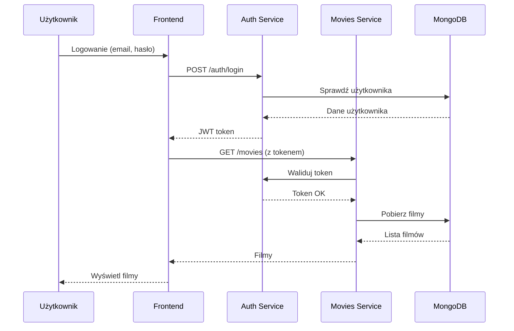

# Dokumentacja projektu

📚 **Zbiór dokumentów** opisujących architekturę i decyzje projektowe

---

## 📁 Zawartość

```
docs/
├── architecture/           # Diagramy architektury
│   ├── system-overview.md  # Przegląd systemu
│   ├── microservices.md    # Architektura mikrousług
│   └── deployment.md       # Diagramy wdrożenia
├── api/                   # Dokumentacja API
│   ├── auth-api.md        # Endpointy uwierzytelniania
│   └── movies-api.md      # API filmów
├── database/              # Schemat bazy danych
│   ├── collections.md     # Kolekcje MongoDB
│   └── indexes.md         # Indeksy i optymalizacje
├── deployment/            # Przewodniki wdrożenia
│   ├── local-setup.md     # Konfiguracja lokalna
│   ├── docker.md          # Praca z Docker
│   └── azure-deploy.md    # Wdrożenie na Azure
└── decisions/             # Architecture Decision Records (ADR)
    ├── 001-microservices.md
    ├── 002-mongodb.md
    └── 003-jwt-auth.md
```

---

## 🏗️ Architektura systemu (high-level)



---

## 🔄 Przepływ uwierzytelniania



---

## 🎯 Cele projektu

### Techniczne
- [x] Nauka architektury mikrousług
- [x] Praktyka z konteneryzacją (Docker)
- [ ] Wdrożenie w chmurze publicznej (Azure)
- [ ] Automatyzacja CI/CD
- [ ] Monitorowanie i logi

### Funkcjonalne
- [ ] System uwierzytelniania
- [ ] Katalog filmów z wyszukiwaniem
- [ ] Wypożyczenia i zwroty
- [ ] Panel administratora
- [ ] Historia użytkownika

---

## 📊 Metryki i cele wydajnościowe

| Metryka | Cel | Pomiar |
|---------|-----|---------|
| Czas odpowiedzi API | < 200ms | Application Insights |
| Dostępność | > 99.5% | Azure Monitor |
| Czas ładowania frontu | < 2s | Lighthouse |
| Przepustowość | 100 req/s | Load testing |

---

## 🔒 Bezpieczeństwo

### Uwierzytelnianie
- JWT tokeny z krótkim czasem życia (30 min)
- Refresh tokeny dla przedłużania sesji
- Hashowanie haseł (bcrypt)

### Autoryzacja
- Role: `user`, `admin`
- Middleware walidacji na każdym endpoincie
- CORS właściwie skonfigurowany

### Sieć
- HTTPS dla wszystkich połączeń
- Network Security Groups w Azure
- Sekrety w Azure Key Vault

---

## 🧪 Strategia testowania

### Jednostkowe (Unit Tests)
- Logika biznesowa w serwisach
- Funkcje pomocnicze
- Cel: > 80% coverage

### Integracyjne
- Endpointy API (FastAPI TestClient)
- Połączenia z bazą danych
- Komunikacja między serwisami

### End-to-End
- Pełne scenariusze użytkownika
- Automatyzacja w Playwright/Cypress
- Uruchamiane w pipeline CI/CD

---

## 📈 Plan rozwoju

### Faza 1: MVP (Current)
- [x] Struktura projektu
- [ ] Auth Service (podstawowy)
- [ ] Movies Service (CRUD)
- [ ] Frontend (lista filmów)

### Faza 2: Core Features
- [ ] Wypożyczenia filmów
- [ ] Panel użytkownika
- [ ] Wyszukiwanie zaawansowane
- [ ] Admin panel

### Faza 3: Advanced
- [ ] Rekomendacje filmów
- [ ] Recenzje i oceny
- [ ] Płatności (Stripe)
- [ ] Powiadomienia email

### Faza 4: Production Ready
- [ ] Monitoring i alerty
- [ ] Backup i disaster recovery
- [ ] Performance optimization
- [ ] Security audit

---

## 👥 Role w zespole

### Backend Developer
- Implementacja API (FastAPI)
- Integracja z bazą danych
- Uwierzytelnianie i autoryzacja
- Testy jednostkowe

### Frontend Developer
- Interfejs użytkownika (React)
- Integracja z API
- UX/UI design
- Testy komponentów

### DevOps Engineer
- Konfiguracja CI/CD
- Infrastruktura jako kod
- Monitoring i logi
- Wdrożenia na Azure

---

## 📚 Przydatne materiały

### Dokumentacja
- [FastAPI Docs](https://fastapi.tiangolo.com/)
- [React Docs](https://react.dev/)
- [MongoDB Manual](https://docs.mongodb.com/)
- [Azure Container Instances](https://docs.microsoft.com/en-us/azure/container-instances/)

### Tutoriale
- [JWT Authentication with FastAPI](https://fastapi.tiangolo.com/tutorial/security/)
- [React Router Tutorial](https://reactrouter.com/en/main/start/tutorial)
- [Docker Multi-stage Builds](https://docs.docker.com/build/building/multi-stage/)

### Narzędzia
- [Postman Collection](./api/postman-collection.json) (gdy będzie gotowe)
- [Database Schema](./database/schema.json)
- [Deployment Scripts](../infra/scripts/)